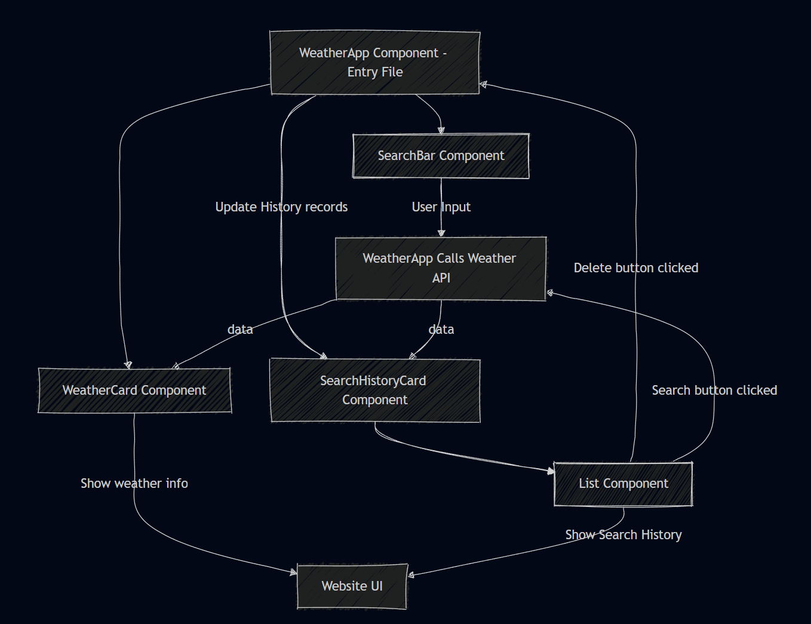

# Weather Application

Tools used: Vite, Typescript, dayjs, Axios. 

## Project design
The application allows users to search for weather information by city or country. It displays current weather details and maintains a history of previous searches. The app supports light and dark themes, stores user's theme preferences and search history in local storage, and lets users re-search or delete past records.

Folders Structure:
- Components – Contains component files. Each component has an associated folder with a .tsx file and a .scss file.
- Constants – Contains commonly used constant files.
- Models – Defines types that are used across different components.
- Services – Contains service classes with methods that perform specific functionalities, such as caching and retrieving data from an API.
- Utils – Contains utility functions, such as string or date formatting.

The entry point component is the "WeatherApp" Component. The component consists of four sub components: 

 - WeatherCard – Displays the weather information.
 - SearchHistoryCard – Displays the search history of weather queries using the List component.
 - SearchBar – Collects user input to search for weather information by city or country.
 - List - A component that receives a configuration consisting of an array of column objects. Each column object represents a column in the list, and its content can be any React node.

 The workflow are illustrated as below: 



## Running the Application

### Development mode (including hot reloading)

```
npm install
```

```
npm run dev
```

### Production build
```
npm run build
```
Then copy 'dist' folder to a location of choice, and run a HTTP server pointing to that location.

### Linting
```
npm run lint
```

### Typescript
```
tsc
```

